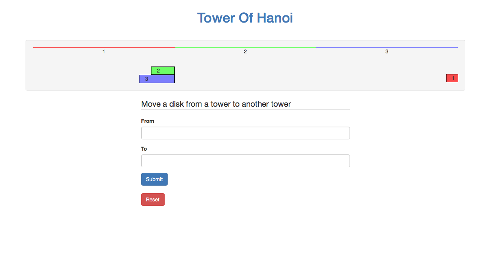

# Sinatra Assessment: Tower of Hanoi

Welcome to the Sinatra "Tower of Hanoi" assessment!  Your job will be to take an existing Tower of Hanoi game and make it a web game by fitting it into a Sinatra application.

We have provided various classes and starter code for you which covers the key functions of the game itself.  You will need to finish the job by making the Sinatra portion of the application work.

There is a suite of tests which will pass when everything has been completed properly.  Some of the exact kinds of tests may seem unfamiliar but you should have no trouble understanding the gist of what they are expecting.

### High Level Overview

There is a `TowerOfHanoi` game class in `lib/tower_of_hanoi.rb`. Its corresponding specs are in `spec/lib/tower_of_hanoi_spec.rb` should you need to see it in use.

**See the "Docs" section at the bottom of this page for the API of the TowerOfHanoi class**

Use this `TowerOfHanoi` class in your `app.rb` to map out your game logic and correctly render the views you need.

A `screenshot.png` file has been included in the root folder to show you what the final app looks like.

### Acceptance Criteria:

In order to successfully complete this assessment you will need to meet the following acceptance criteria:

- `app.rb` has:
    - a `GET /` route
    - a `POST` route to which the move form submits
- game begins with the default state (all disks in tower 1)
- state is persisted between moves
- state is deleted upon winning
- views properly render their child views (partials)
- child views receive the variables they depend on
- player inputs move from a form `POST` request
- form input is validated before moving disks
- an error message is displayed when the input is invalid
    - `'Invalid move'`
- a success message is displayed when the user wins
    - `'You win'`

### Getting Started

1. Fork and clone this repository into your own.
1. Install the gems
    `$ bundle install`
1. Run guard
    `$ bundle exec guard`
1. Start up the server (rerun retarts the server after file changes)
    `$ rerun app.rb`

### What You Need to Modify

#### `app.rb`

The `app.rb` file currently only requires `Sinatra` and the `TowerOfHanoi` game class. Flesh out the routes, game state updating, and persistence here!

#### `views/`

**Prepopulated:**

- `views/layout.erb`

**Missing code:**

- `views/disk.erb`
- `views/form.erb`
- `views/game.erb`
- `views/tower.erb`

### What to Think About:

- some views need to render other views as partials
    - think about parent child relationships here
- make sure views and their partials get the variables they're expecting!
- fill in the gaps to make the game work and the tests pass!

### What You Do NOT Need To Modify Directly

#### `public/style.css`

CSS classes have been created in the `public/style.css` file and applied for you.

**Don't change these! Some of the tests need them in order to identify that portions of the Views are rendering correctly!**

The way the CSS selectors are nested in the specs should give you clues on how to solve this.

#### `specs/`

Your existing specs are in these 2 folders:

- `spec/features/`
- `spec/views/`

Here is the suggested order to solve them:

- `views/game_spec.rb` (This should give you an idea of how view tests work)
- `views/tower_spec.rb`
- `views/disk_spec.rb`
- `views/form_spec.rb` (pay close attention to the input and label attributes being targeted!!!)
- `features/game_play_spec.rb`
- `features/user_feedback_spec.rb`
- `features/winning_spec.rb`

### `screenshot.png`

- a screenshot of the finished app

### Good luck!

## Docs

This section is for your reference only.

### `lib/tower_of_hanoi.rb`

### `TowerOfHanoi`

- `NUM_DISKS`: 3
- `towers`: `attr_accessor` for the game state (2D array)
- `#initialize(game_state=nil)`
    - optionally accepts a game state as a parameter i.e. `[[2, 3], [], [1]]`
    - sets a default state when no state is given i.e. `[[1, 2, 3], [], []]`
- `#move(from, to)`
    - accepts `from` and `to` integer parameter(s)
    - moves the first disk on the `from` tower to the `to` tower
- `win?`
    - returns a `boolean`
    - `true` when the game state is the winning state
    - `false` when the game state is not the winning state
- `valid_move?(from, to)`
    - accepts `from` and `to` integer parameter(s)
    - returns a `boolean`
    - `true` if the move is valid
    - `false` if:
        - `from` == `to`
        - `from` or `to` is not `1`, `2` or `3` (valid tower numbers)
        - the `from` tower has no disks (empty)
        - the top disk on the `from` tower is larger than the top disk on the `to` tower

 
 
 

